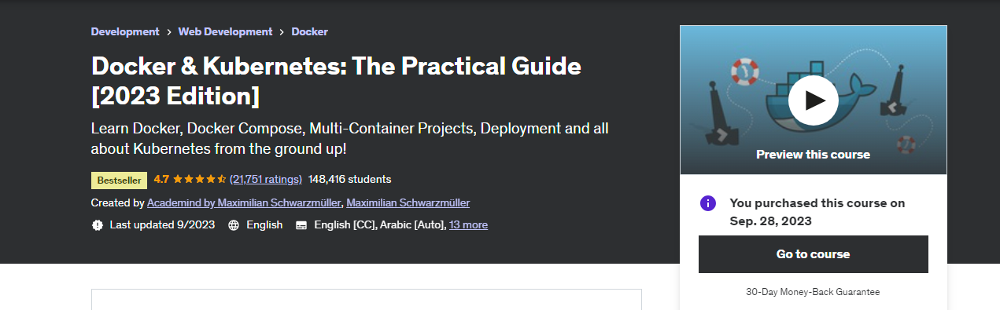

# Docker & Kubernetes: The Practical Guide [2023 Edition]

### Learn Docker, Docker Compose, Multi-Container Projects, Deployment and all about Kubernetes from the ground up!
Course: (https://www.udemy.com/course/docker-kubernetes-the-practical-guide/)  
Course length: <b>23.7 hours</b> 
Course Instructor: Academind by Maximilian Schwarzmüller
   

### Life cycle of Course Outline:
| Section | Topics | Completed |
| ---: | --- | :---: |
| Section 01 | Getting Started | &check; |
| Section 02 | Docker Images & Containers: The Core buildding block | &check; |  
| Section 03 | Managing Data and Volumes | &check; |  
| Section 04 | Networking: Cross-Container Communication | &check; |  
| Section 05 | Building Multi-Container App with Docker | &check; |  
| Section 06 | Docker Compose | &check; |  
| Section 07 | Working with Utility Containers & executing commands in containers | &check; |  
| Section 08 | A more Complex Setup: Lavarel & PHP project | &check; |  
| Section 09 | Deploying Docker Container |  |  
| Section 10 | Docker & Container: Summary |  |  
| Section 11 | Getting Started with Kubernetes |  |  
| Section 12 | Kubernetes in action - Core concept |  |  
| Section 13 | Managing Data & Volumes Kubernetes |  |  
| Section 14 | Networking with Kubernetes |  |  
| Section 15 | Kubernetes - Deployment(AWS EKS) |  |  