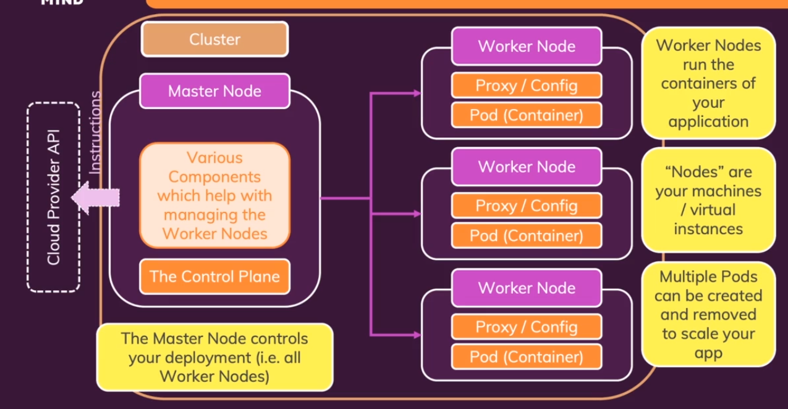

# Kubernetes Architecture

CLuster = set of nodes machines

Nodes = virtual or physcal machines
    master node = controller and manager
    worker nodes = host pods + resources

Pods = Run and contain container + resources (config ENV + volumes)

Container = docker container

Services = logical set of Pods to be unique independent IP for internet

