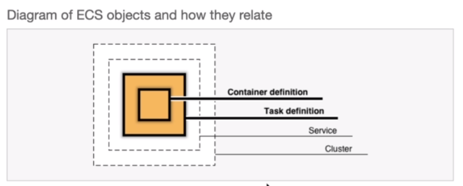

# EC2

#### local deploy - development mode
docker build -t sec09-1 . 
docker run -d --rm -p 3000:80 --name node-section9-1 sec09-1

#### remote deploy - production mode
1. Create a instance in AWS with key pair
2. connect to SSH client
3. install docker [https://cloudkatha.com/how-to-install-docker-on-amazon-linux-2023/]
```
sudo yum update -y
sudo yum -y install docker

sudo service docker start
sudo systemctl enable docker
sudo usermod -a -G docker ec2-user

sudo systemctl status docker
```

4. Locally docker build, tag and push to docker hub remote as public repo
```
docker build .
docker tag de7181c8c43d rmc3408/sec9-deploy-1
docker push rmc3408/sec9-deploy-1
```

5. Inside EC2, grab public repo and docker run
```
docker run -d --rm -p 3000:80 rmc3408/sec9-deploy-1
```

6. Add inbound rules to security group. Accept new port
HTTP if port 80
Custom TCP to get port 3000.

7. To update code again, build and push locally and docker pull and run on SSH


# ECS
obs: NOT AWS FREE SERVICE



1) CLUSTER = VPC with all networks, subnets
2) SERVICE - load balancer or security group
  - load balance is multiple instance access same domain
  - auto-scaling is how many server are runnning to react all user
3) Create TASK to decide physical running and host the container \
  Which server: 
  - FARGATE - Serverless store in anywhere. Only pay if runnning
  - EC2 - choose memory, CPU and HD size
4) Add container 
  - Image source from DockerHub
  - Port mapping port 80
  - Network settings use for multiple containers
  - Enviroments 
    - command (node,app.js)
    - working directory (/app),
    - env variables. \
    carefull, not container service name anymore.
    If mulitple container in the same TASK, they will be same machine, so use `localhost`
  - No Volumes, no bind mounts.


### ECS mulicontainers

Should be one task with multiples containers.

__SERVICES__
  - FARGATE
  - minimum hardware
  - choose VPC
  - public IP enable
  - Application load balance 
    - go to EC2, create load balancer
    - same port as container
    - VPC must be same and Subnets
    - VPC choose security group, register targets be automatically
  - HealthCheck will reach endpoints `/`. Be sure has right i.e.`/goals` 
  
__mongoDB__
  - port 27017
  - enviroments variables
  - no volume, no saving data.
__backend__
  - port 80
  - enviroment variables


__To Update container__

On VSCode, build local, push to docker hub. \
On AWS, go to services, click on bttn update and force new deployment.

**persist data via EFS** \
Go `Task revision` and go to `create new revision` if some change settings. Because if no volume is set up, once stop service, lost all data.

Choose EFS volume to keep data. Must be same VPC, subnets, However, you must have a security group for EFS and inbound rules to Source connect to ECS security group.

So, on service from ECS, add volume to connect to EFS. Archicteture of connection is: ->
EFS+securitygroup1 <-> 
ECS+securitygroup2 + EFS call data <->
mongocontainer + volume EFS data

If 2 Tasks are running at same time will cause STOPPED. They will try to access database and give error. STOP all and restart to fix. Or use `startup dependency ordering`


**Persist data via MongoDB Atlas**

Create mongo Atlas account \
create cluster \
choose AWS provider
- check mongoDB version. Carefull, if local container uses mongo container, it must match the same mongo version in mongo Atlas. Typically, use same connection in local and production (since is development is small data)
- get mongoDB URL, database name
- Add Network Access (add IP 0.0.0.0 to anywhere)
- On AWS, add environments variables
- DELETE mongo container, EFS, securitygroup2.  


## ECS FrontEnd in production - Build step

Build command dont have webserver

